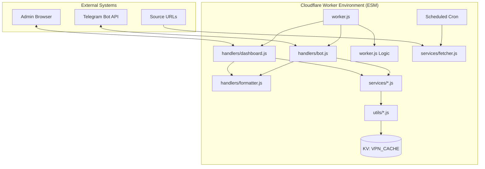

# Comprehensive Documentation: VPN Config Bot Pro

## 1. Overview
The **VPN Config Bot Pro** is a powerful Cloudflare Worker that automates the lifecycle of VPN configuration distribution via Telegram. It scrapes configurations from various sources, tests their connectivity and latency, allows community voting, and redistributes high-quality configs to Telegram channels.

---

## 2. Feature List

### Core Automation
- **Config Extraction**: Scrapes plain text from configured URLs and extracts VPN configs (VLESS, VMess, Trojan, Shadowsocks) using advanced regex and protocol-specific parsing.
- **Protocol Support**: Comprehensive support for `vless://`, `vmess://`, `trojan://`, and `ss://` (including legacy base64 formats).
- **Intelligent Testing**: Tests each config via DNS-over-HTTPS (Cloudflare) and TCP/HTTPS `HEAD` requests to verify connectivity and measure latency.
- **Automatic Distribution**: Discovered and tested configs are automatically posted to configured Telegram channels.
- **Scheduled Cleanup**: Periodically removes dead, stale, or unpopular configurations to maintain a high-quality feed.
- **Publish Queue**: Paces the distribution of new configurations to avoid flooding channels. Configurable interval and batch size.

### Telegram User Interface
- **Professional Persistent Reply Menu**: A context-aware reply keyboard provides easy navigation. Buttons are logically grouped (e.g., Latest/Best, Submit/Subscription) for a superior UX. The system ensures that pressing any menu button immediately clears any pending input states (like "Awaiting Config"), preventing users from getting "trapped" in a state.
- **Admin Visibility**: The "🔐 Admin Panel" button is strictly visible only to the authorized administrator, ensuring a clean interface for regular users.
- **Monospaced Configs**: All configs are sent in a monospaced format, allowing users to tap and copy them instantly.
- **Bundle Submissions**: If a user sends multiple configurations in one message, the bot groups them into a single "Bundle" for approval.
- **Quality Reporting**: Users can report dead or slow configurations using the **👎 Report** button. High report counts negatively impact the config's Quality Score.
- **Quality Score**: A sophisticated scoring system that combines automated test results, user reports, and "Auto-Likes" from external sources (e.g., Android App).
- **On-Demand Retrieval**: Users can fetch the 20 `/latest` or 20 `/best` (highest Quality Score) configurations directly through the bot. High-performance background processing ensures the bot remains responsive during delivery.
- **Submission System**: Users can submit raw configs or text containing configs; the bot extracts and queues them for admin approval.

### Admin Features
- **Dashboard API & UI**: A complete web-based management interface for monitoring stats, managing links/channels, and approving submissions.
- **Customizable Templates**: Admins can edit message templates per protocol using placeholders like `{server}`, `{status}`, `{rating}`, `{latency}`, `{channel}`, `{location}`, `{user}`, `{count}`, and `{configs}`.
- **Template Reset**: Ability to instantly restore all message templates to their default values from the dashboard.
- **Manual Control**: Force cleanup or fetch operations via Telegram commands or the dashboard.
- **Submission Management**: Review pending user submissions with one-click approve/reject functionality.

---

## 3. System Architecture

The project follows a modular, component-based architecture using ES Modules (ESM). The logic is organized into dedicated modules within the `worker/src/` directory, providing better maintainability and scalability.

### Modular Structure:
- **`worker/worker.js`**: The main entry point that handles routing and initializes the environment.
- **`worker/src/handlers/`**:
    - `bot.js`: Logic for handling Telegram webhook updates and callback queries.
    - `dashboard.js`: Implementation of the Admin Dashboard REST API.
    - `formatter.js`: Shared logic for formatting Telegram messages and keyboards.
- **`worker/src/services/`**:
    - `fetcher.js`: Orchestrates the scraping and testing of new configurations.
    - `storage.js`: Manages KV persistence, deduplication, and automated cleanup.
    - `voting.js`: Implements the quality scoring and community rating system.
    - `queue.js`: Handles the delayed publication queue logic.
- **`worker/src/utils/`**:
    - `kv.js`: Optimized KV helpers with local in-memory caching.
    - `telegram.js`: Rate-limited Telegram API client.
    - `vpn.js`: Protocol-specific parsing (VLESS/VMess/Trojan/SS) and connectivity testing.
- **`worker/src/templates/`**:
    - `html.js`: Centralized storage for Dashboard and Portfolio UI templates.
- **`worker/src/constants.js`**: Global configuration defaults and regex patterns.

### Component Diagram:



---

## 4. Operational Scenarios

### Scenario A: Automated Aggregation
The bot runs on a schedule (e.g., every minute), fetches new links from GitHub/Gist sources, tests them, and posts active ones to the main channel without any human intervention.

### Scenario B: Community Curation
Users submit configurations they found. The admin receives a notification, approves the submission via the dashboard, and the bot then tests and publishes it, giving credit to the source/submitter.

### Scenario C: Quality Maintenance
Over time, configurations may die or become slow. The cleanup task runs daily, checking if configs have passed their "stale" threshold or have too many failed tests, automatically purging the database.

---

## 5. Technical Documentation

### 5.1 Environment Variables (Secrets)
| Variable | Description |
|---|---|
| `BOT_TOKEN` | Your Telegram Bot Token from @BotFather. |
| `ADMIN_CHAT_ID` | Your Telegram User ID (used for admin access). |
| `CHANNEL_ID` | Default channel ID (e.g., `-100...`) for distribution. |
| `DASHBOARD_USER` | Username for the web dashboard. |
| `DASHBOARD_PASS` | Password for the web dashboard. |

### 5.2 Key Logic & Performance
- **Rate Limiting**: Implements a `RateLimiter` class to respect Telegram's message limits (approx. 30 msg/s).
- **Concurrency**: Uses `promiseAllWithLimit` to batch network requests (tests/sends) without overloading the Worker or remote servers.
- **Parsing**: Robust extraction using the `URL` API and safe Base64/JSON parsing for complex protocols like VMess.
- **Testing**: Dual-stage testing (DNS followed by HTTP/HTTPS HEAD) ensures high accuracy of "Active" status.

### 5.3 Storage & Deduplication Policies
- **Sharded Storage Architecture**: Configurations are sharded into **20 buckets** based on their protocol (`vless`, `vmess`, `trojan`, `ss`) and the first character of their hash (5 sub-groups per protocol).
  - **Key Format**: `cfgs:{protocol}:{group}` (e.g., `cfgs:vless:1`).
  - **Bucket Logic**: Chars `0-6` → G1, `7-d` → G2, `e-k` → G3, `l-r` → G4, `s-z` → G5.
- **Smart Provider Tracking**: Each configuration stores a `provider` field, extracted from the source text or internal metadata (ps/hash). If no source is found, it defaults to the configured `channelUsername`.
- **Country-Specific Hot-Path Indexing**: The system maintains an optimized index for each country (`top:country:{CC}`) containing the top 100 highest-quality active configurations. This allows for near-instant responses for location-based API queries.
- **Response Caching Layer**: Public API endpoints (`/api/configs`, `/api/sub`) utilize a frequency-based cache in KV with a 5-minute TTL. Responses are cached based on request parameters, further reducing database load for high-traffic requests.
- **Optimized Voting Storage**: Vote counts (`likes_count`, `dislikes_count`) and a FIFO queue of the last 20 voter IDs (`recent_voters`) are stored directly within each configuration object. This eliminates redundant KV subrequests when listing configurations.
- **Storage Limit**: Each bucket maintains a strict limit of **100 configurations**, allowing for a total system capacity of **2,000 active configurations**.
- **Smart Deduplication**: Configurations are compared based on their core connection parameters. Any text after the `#` symbol or the `ps` field in VMess is ignored during comparison.
- **Auto-Cleanup Pipeline**: When a bucket reaches its 100-item limit, the bot performs a 6-stage cleanup on that specific shard:
  0.  **Quality Purge**: Remove configurations with a Quality Score below -200.
  1.  **Remove Dead**: Delete all configs marked as "dead".
  2.  **Age Check**: Delete configs older than **10 days**.
  3.  **Latency Check**: Delete configs with high latency (ping > 2000ms).
  4.  **Proactive Testing**: Retest oldest configs in the bucket and remove those that fail.
  5.  **FIFO**: Remove oldest configs if the bucket is still over the limit.

### 5.4 Publish Queue Configuration
Admins can enable the **Publish Queue** in the dashboard settings:
- **Enable Queue**: Toggle whether new configs should be sent immediately or wait in line.
- **Queue Interval (min)**: How many minutes between publication runs.
- **Queue Batch Size**: How many configs (or bundles) to publish in each run.

### 5.5 User-to-User Subscription System
Users who contribute at least **20 approved configurations** to the main channel can start their own subscription service via the **💎 My Subscription** menu.

#### Features for Sub-Admins:
- **Admin ID**: A unique identifier for their service.
- **Personal Config Pool**: Manage a dedicated list of configurations separate from the bot's public pool.
- **Client Management**: Create unique **Subscription Codes** (`AdminID-ClientID`) for their users.
- **Usage Limits**: Set Volume (GB) and Activation (Device) limits for each client.
- **Live Stats**: Monitor total traffic and client activity.

#### Sub-Admin API (for Android App):
- **GET `/api/user-sub?code=...`**:
  - Validates the code and returns the personal config list in Base64 format.
  - Checks if volume limits are exceeded.
- **POST `/api/user-sub/report`**:
  - Body: `{"code": "...", "volumeMB": 1024, "activate": true}`
  - Updates the client's consumed volume and activation count in KV.

---

## 6. Strengths & Weaknesses

### ✅ Strengths
- **Fully Serverless**: Zero hosting costs on Cloudflare's Free Tier.
- **Native UX**: Monospaced text for instant copy-paste on mobile.
- **Resilient**: Robust error handling for malformed configs and network timeouts.
- **Highly Configurable**: Templates and settings can be changed in real-time via the dashboard.

### ❌ Current Weaknesses
- **Free Tier Limits**: KV read/write limits may be reached under extremely high volume (e.g., >100,000 daily operations).
- **Protocol Depth**: Currently limited to TCP/HTTPS reachability; does not perform a full protocol handshake (e.g., UDP testing).

---

## 7. Roadmap & Improvements
- [x] **Geo-Location**: Integration with IP-API to show server location flags.
- [ ] **Durable Objects**: Advanced rate limiting for users with a paid Cloudflare plan.
- [ ] **Multi-Protocol**: Future support for WireGuard and OpenVPN profiles.
- [ ] **Advanced Metrics**: Visual charts for uptime and popularity trends.

---

## 8. API Reference

The bot provides a REST API for management and integration. All dashboard endpoints require a Bearer Token obtained via `/login`.

### Authentication
- **POST `/dashboard/api/login`**
  - Body: `{"username": "...", "password": "..."}`
  - Returns: `{"token": "..."}`

### Management Endpoints (Auth Required)
- **GET `/dashboard/api/stats`**: Get system statistics.
- **GET `/dashboard/api/configs?sort=newest&limit=20&page=1`**: Fetch stored configs.
- **POST `/dashboard/api/templates/reset`**: Restore all templates to defaults.
- **POST `/dashboard/api/fetch-now`**: Trigger manual config scraping.
- **POST `/dashboard/api/vote`**: Submit votes (single or batch).
  - Single: `{"config_hash": "...", "vote": "like|dislike"}`
  - Batch: `{"votes": [{"hash": "...", "type": "like"}, ...]}`
- **POST `/dashboard/api/settings`**: Update bot settings.
  - Body: `{"key": "all", "value": { ... }}`
- **GET `/dashboard/api/app-update`**: Fetch current Android app update info.
- **POST `/dashboard/api/app-update`**: Update Android app release info.
  - Body: `{"version": "1.2.0", "description": "New features", "link": "https://...", "force": true}`
- **POST `/dashboard/api/announcements`**: Update app announcements.
  - Body: `{"title": "...", "message": "...", "active": true}`
- **POST `/dashboard/api/broadcast`**: Send a message to all Telegram bot users.
  - Body: `{"message": "..."}`

### Public Endpoints (No Auth)

- **GET `/api/configs?limit=10&country=US&min_quality=50&sort=best`**
  - Returns a JSON list of active raw configurations.
  - Parameters:
    - `limit`: (Optional) Max number of configs (default 10, max 100).
    - `country`: (Optional) Country code (e.g., `US`, `DE`).
    - `min_quality`: (Optional) Minimum Quality Score (default 0).
    - `sort`: (Optional) Use `best` to sort by Quality Score.
  - Example Response:
    ```json
    {
      "count": 2,
      "country": "US",
      "min_quality": 50,
      "sort": "best",
      "configs": ["vless://...", "vmess://..."]
    }
    ```

- **GET `/api/sub?limit=100&country=DE&min_quality=0`**
  - Standard V2Ray Subscription endpoint.
  - Returns a **Base64-encoded** string of configurations (plain text).
  - Perfect for use in apps like v2rayNG or your custom Android app.

- **GET `/api/countries`**
  - Returns a list of all countries that currently have active configurations.
  - Example Response:
    ```json
    [
      { "country": "Germany", "countryCode": "DE", "count": 15 },
      { "country": "United States", "countryCode": "US", "count": 8 }
    ]
    ```

- **GET `/api/app-update`**
  - Returns latest Android app version and download information.
  - Example Response:
    ```json
    {
      "version": "1.2.0",
      "description": "Bug fixes and performance improvements",
      "link": "https://example.com/app.apk",
      "force": false,
      "updated_at": "2024-03-20T12:00:00.000Z"
    }
    ```

- **GET `/api/announcements`**
  - Returns the current active app announcement.
  - Example Response:
    ```json
    {
      "title": "New Server added!",
      "message": "We have added 5 new servers in Germany. Enjoy!",
      "active": true,
      "updated_at": "2024-03-20T12:00:00.000Z"
    }
    ```

---

## 9. Admin Commands Reference

Admins can control the bot directly via Telegram:

- `/start`: Open Admin Menu.
- `/check`: Force immediate scraping and distribution.
- `/cleanup`: Manually trigger the removal of dead/old configs.
- `/status`: View detailed KV and queue statistics.
- `/add_link [URL]`: Add a new source link.
- `/add_channel [ID]`: Add a new destination channel ID.
- `/submit`: Enter submission mode to add a config manually.